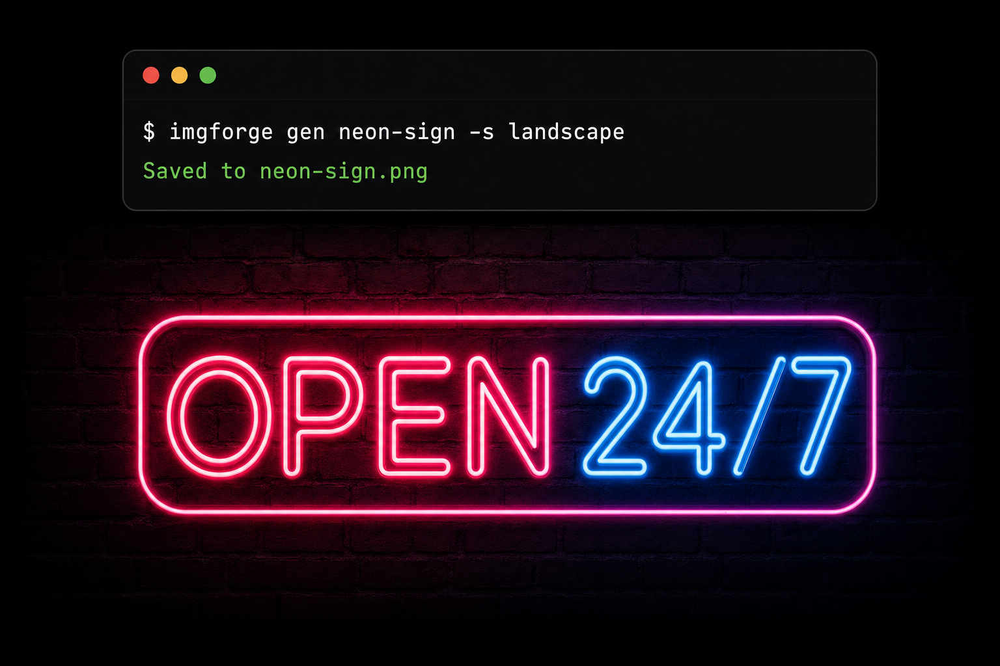

# imgforge

Generate images with OpenAI from your terminal. One file, zero dependencies.

<p align="center">
  
</p>

## Why imgforge

- **Zero dependencies** — stdlib only. No `pip install`, no venv, no SDK. Just Python 3.10+
- **One file** — `curl` it, `chmod +x`, done. 440 lines, runs anywhere Python runs
- **Cost-aware** — shows estimated cost before and after every generation. No surprise bills
- **Built-in templates** — prompt templates for product shots, social media, diagrams, blog images
- **Full API coverage** — sizes, quality tiers, formats, batch generation, transparent backgrounds

## Install

```bash
curl -fsSL https://raw.githubusercontent.com/saadnvd1/imgforge/main/imgforge -o ~/.local/bin/imgforge && chmod +x ~/.local/bin/imgforge
```

Set your API key:

```bash
export OPENAI_API_KEY="sk-..."
```

## Usage

```bash
# Generate an image
imgforge gen "a cat astronaut floating in space"

# Specific size and quality
imgforge gen "mountain landscape at sunset" -s landscape -q high

# Multiple images at once
imgforge gen "minimalist logo variations" -n 4 -s square

# Custom output path and format
imgforge gen "product hero shot" -o hero.webp -f webp

# Estimate cost without generating
imgforge cost -s landscape -q high -n 10

# Browse prompt templates
imgforge templates
imgforge templates product-hero
```

### Edit existing images

> **Note:** OpenAI's edits endpoint does not yet support `gpt-image-2` (April 2026). The edit command is implemented and ready — will work once OpenAI enables it.

```bash
imgforge edit photo.jpg "make it look like a watercolor painting"
imgforge edit photo.jpg "replace the sky with aurora" -m sky-mask.png
imgforge edit logo.png bg.jpg "place the logo in the center"
```

## Reference

### Sizes

| Shortcut | Resolution | Use case |
|----------|-----------|----------|
| `square` / `1k` | 1024x1024 | Social posts, icons |
| `portrait` | 1024x1536 | Mobile, posters |
| `landscape` / `wide` | 1536x1024 | Blog headers, OG images |
| `hd` / `2k` | 2048x2048 | Print, high-res |
| `4k` | 3840x2160 | Widescreen, cinematic |

Or pass any `WxH` directly.

### Quality and cost

| Quality | ~Cost/image | When to use |
|---------|------------|-------------|
| `low` | $0.011 | Drafts, exploration, bulk |
| `medium` | $0.042 | General use, social media |
| `high` | $0.167 | Final assets, typography |

### Templates

Built-in prompt templates for common use cases:

| Template | What's in it |
|----------|-------------|
| `product-hero` | App icons, device frames, SaaS dashboards |
| `social-media` | OG images, GitHub previews, YouTube thumbnails |
| `diagrams` | Architecture diagrams, flowcharts, ER diagrams |
| `blog-images` | Hero images, comparison splits, abstract patterns |
| `creative` | Isometric art, pixel art, posters, neon signs |

Templates are markdown files in `templates/`. Add your own.

## Use with AI coding agents

imgforge includes a `SKILL.md` that AI coding agents (Claude Code, Codex, etc.) can read to use the tool effectively. Instead of writing naive prompts, the agent references the built-in prompt examples and writes structured prompts that produce better results.

Just point your agent at the repo and ask it to generate an image — it handles the rest.

## Requirements

- Python 3.10+
- An [OpenAI API key](https://platform.openai.com/api-keys) with image generation access
- That's it

## License

MIT

## Author

Built by [Saad Naveed](https://saadnaveed.com). More open source tools at [saadnaveed.com/projects](https://saadnaveed.com/projects).
